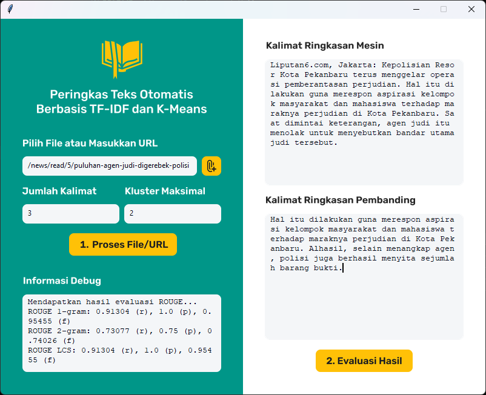

# Text Summarization using TF-IDF and K-Means
Extractive text summarization tool using TF-IDF and K-means clustering. Targeted for [Liputan6](https://www.liputan6.com) news site but may also be used on other sites or local documents. GUI was made using Figma and [Tkinter Designer](https://github.com/ParthJadhav/Tkinter-Designer) (doesn't support high DPI screen natively).

## Key Terms
In case you're unfamiliar with Natural Language Processing (NLP).
|||
|-|-|
|Web scrapping|Getting only the important text from a website (without the ads, comments, etc)|
|Document|Full text received after scrapping (original/unmodified)|
|Extractive summarization|Summarization by extracting/reordering sentences from document (full text) without changing the sentences themselves. Its opposite is an abstractive summarization|
|Sentence segmentation|Splitting document into list of sentences|
|Stopword removal|Removing useless words from document (e.g. preposition)|
|Word stemming|Reducing a word to its base form (eating -> eat). Usually implemented by using regex or certain rules but may produce errors (historical -> histori)|
|Word lemmatization|Similar to stemming but by using a [dictionary](https://www.w3schools.com/python/python_dictionaries.asp) to replace word to its base form. Has better accuracy than stemming if the dictionary is huge/complete|
|Word tokenization|Splitting a sentence into list of words|
|TF-IDF|Algorithm that uses the frequency of words to determine how relevant those words are to a given document|
|K-means clustering|An unsupervised ML algorithm that groups similar data points (sentences) into the same clusters/categories (based on the number of K/clusters)|
|Elbow, silhouette method|Methods for calculating the most efficient number of clusters|
|Hypothesis|Result (text summary) generated by the current model|
|Reference|Reference to be compared with hypothesis. It is assumed to be better than the hypothesis and usually made directly by humans (not automated)|
|ROUGE|Recall oriented metric for evaluating automatic summarization (by comparing hypothesis and reference)|

## Setup
1. Open terminal or PowerShell
2. Create a Python virtual environment: `python3 -m venv .venv`
3. Activate the environment: `source .venv/bin/activate`. VS Code may do this automatically for you
4. Download and install the required dependencies: `pip install -r requirements.txt`
5. Extract `dataset` folder from `dataset.7z` (the password is a 4 digit number) or request it [here](https://github.com/fajri91/sum_liputan6) directly
6. Run either `_main.py` (Tkinter GUI) or `jupyter.ipynb` (Jupyter Notebook)
7. The result will be shown directly (and also stored in `output/log.csv`)

You can also get automatic reference summary by [requesting an API key](https://smmry.com/api) from SMMRY (put it as `SM_API_KEY` in the code). Otherwise, you may need to write the reference summary manually each time the model produced a result (for sites other than [Liputan6](https://www.liputan6.com)).

## Screenshot

## Source
Liputan6 corpus dataset by Fajri Koto ([repo link](https://github.com/fajri91/sum_liputan6)). Non commercial use only!